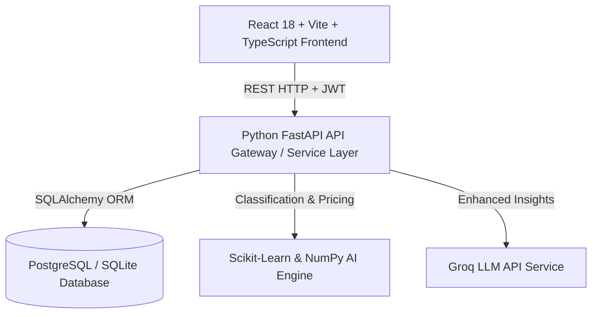
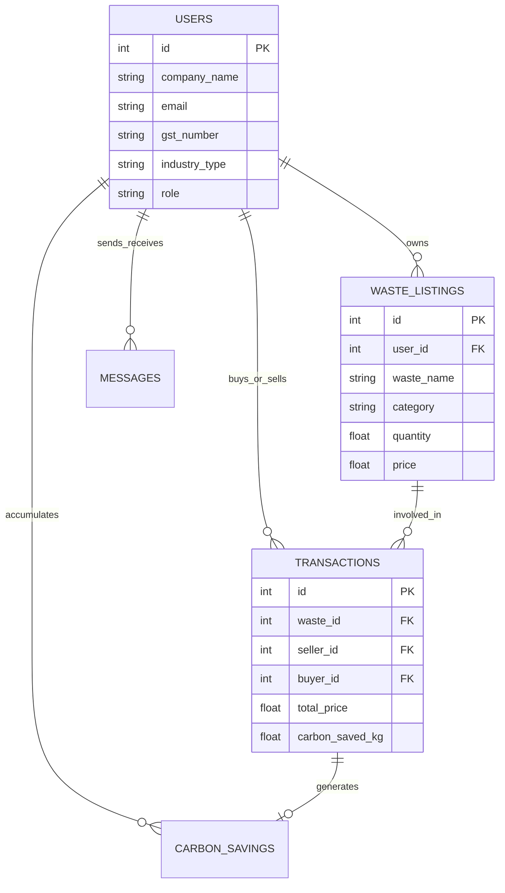
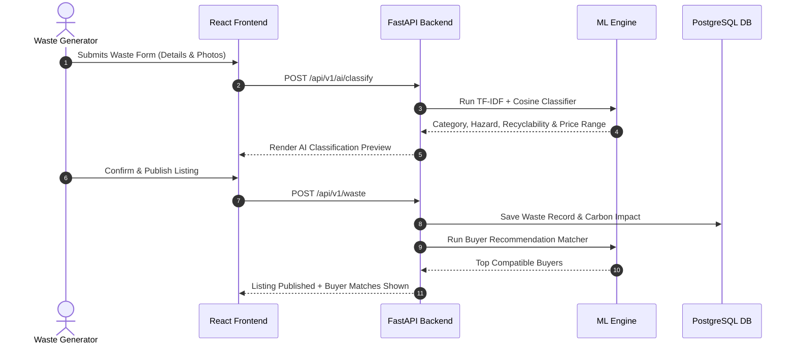

# Waste2Wealth AI - System Architecture & Design Specification

## Overview

Waste2Wealth AI is an end-to-end industrial waste exchange marketplace leveraging Machine Learning and AI to match waste-generating MSME industries with buyers capable of repurposing industrial by-products.

---

## 1. System Architecture Diagram

---

## 2. Entity-Relationship (ER) Diagram

---

## 3. Sequence Diagram - Waste Upload & AI Matching Workflow

---

## 4. Key AI Components
1. **Smart Waste Classification**: Uses TF-IDF vectorization & Cosine Similarity on industrial waste descriptions trained on chemical, metal, fly ash, and polymer datasets.
2. **Buyer Recommendation Engine**: Combines industry compatibility matrices with spatial Haversine distance scoring.
3. **Price Prediction Engine**: Multi-variable regression calculating optimal pricing based on moisture %, quality grade, volume, and hazard tier.
4. **EPA Carbon Calculator**: Estimates CO₂ reduction (kg), tree absorption equivalents, kWh energy saved, and landfill diversion volume (m³).
